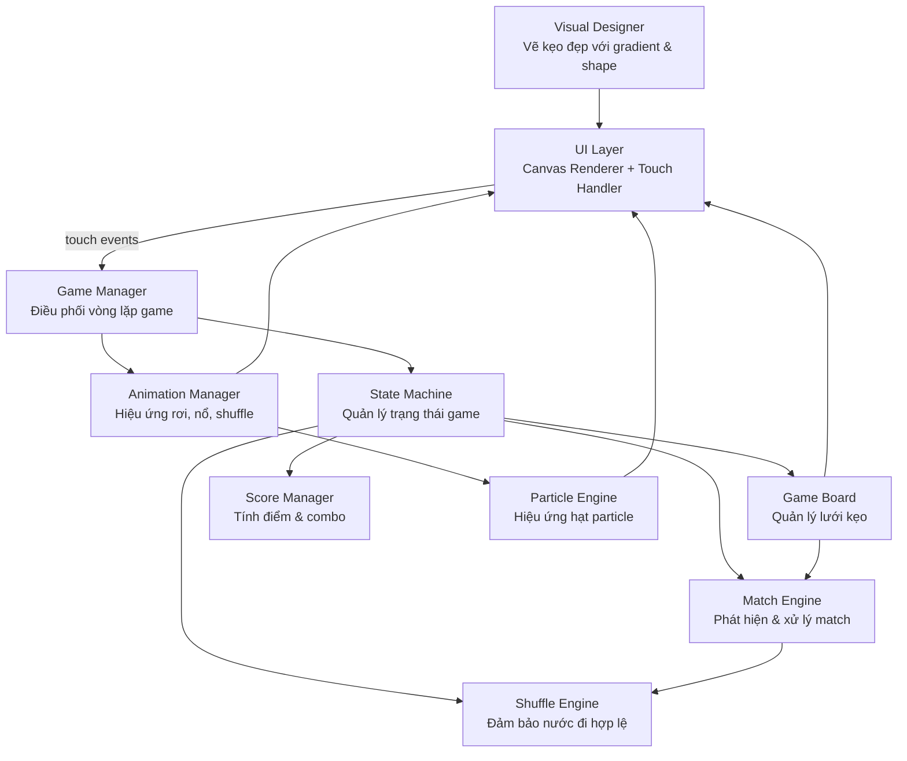
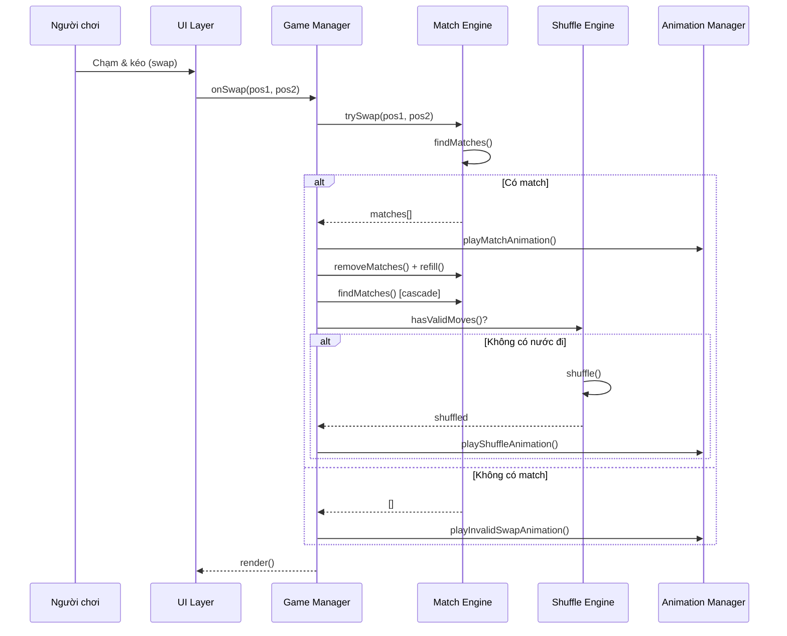
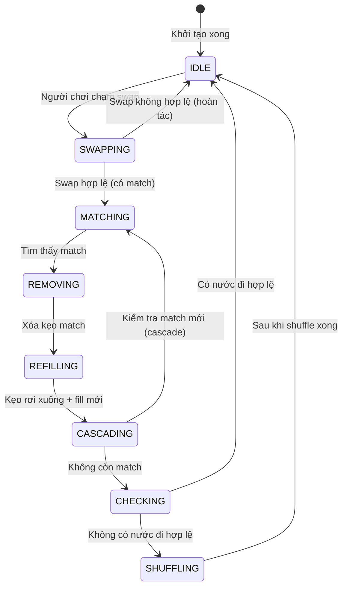

# Tài Liệu Thiết Kế: Candy Crush Saga (Web Mobile)

## Tổng Quan

Game Candy Crush Saga dành cho trình duyệt web trên thiết bị di động. Người chơi hoán đổi các viên kẹo liền kề trên lưới để tạo thành chuỗi 3 kẹo cùng màu trở lên. Game không có điểm kết thúc — người chơi chơi liên tục, không bị "game over" vì hết nước đi. Hệ thống luôn đảm bảo tồn tại ít nhất một nước đi hợp lệ bằng cơ chế shuffle tự động.

Game được xây dựng thuần túy bằng HTML5 Canvas + TypeScript, không phụ thuộc framework nặng, tối ưu cho màn hình cảm ứng mobile.

---

## Phần 1: High-Level Design

### 1.1 Kiến Trúc Tổng Thể



### 1.2 Luồng Chính (Main Flow)



### 1.3 State Machine



### 1.4 Các Thành Phần (Components)

#### GameManager
- Điều phối toàn bộ vòng lặp game (game loop)
- Nhận input từ UI, gọi các engine xử lý
- Quản lý State Machine

#### GameBoard
- Lưu trữ lưới kẹo 2D (mảng `Candy[][]`)
- Cung cấp API đọc/ghi vị trí kẹo
- Xử lý refill (đổ kẹo mới từ trên xuống)

#### MatchEngine
- Phát hiện tất cả match (3+ kẹo liền kề cùng màu)
- Xác định loại match đặc biệt (L-shape, T-shape, 4-match, 5-match)
- Tạo kẹo đặc biệt (striped, wrapped, color bomb)

#### ShuffleEngine
- Kiểm tra xem có nước đi hợp lệ không (`hasValidMoves`)
- Shuffle lưới khi không còn nước đi
- Đảm bảo sau shuffle: không có match sẵn, có ít nhất 1 nước đi hợp lệ

#### ScoreManager
- Tính điểm theo số kẹo match và combo multiplier
- Lưu điểm cao nhất (localStorage)

#### AnimationManager
- Quản lý hàng đợi animation (swap, match, fall, shuffle, idle, select, particle)
- Đảm bảo animation không chồng chéo
- Điều phối ParticleEngine cho hiệu ứng nổ

#### VisualDesigner
- Vẽ từng loại kẹo với hình dạng đặc trưng, gradient, highlight, shadow
- Cung cấp pipeline vẽ kẹo theo layer (shadow → body → gradient → highlight → icon)

#### ParticleEngine
- Tạo và cập nhật hệ thống hạt particle
- Hỗ trợ các loại: spark, star, burst, trail

#### Renderer (Canvas)
- Vẽ lưới kẹo lên HTML5 Canvas
- Hỗ trợ retina display (devicePixelRatio)
- Responsive theo kích thước màn hình

### 1.5 Mô Hình Dữ Liệu

#### Candy
```typescript
interface Candy {
  id: number           // unique id để track animation
  type: CandyType      // loại kẹo (màu sắc)
  special: SpecialType // kẹo thường hay đặc biệt
  row: number          // vị trí hàng hiện tại
  col: number          // vị trí cột hiện tại
  animState: CandyAnimState  // trạng thái animation hiện tại
}

enum CandyType {
  RED, ORANGE, YELLOW, GREEN, BLUE, PURPLE
}

enum SpecialType {
  NORMAL,
  STRIPED_H,   // kẹo sọc ngang (match 4)
  STRIPED_V,   // kẹo sọc dọc (match 4)
  WRAPPED,     // kẹo bọc (match L/T)
  COLOR_BOMB   // bom màu (match 5)
}

interface CandyAnimState {
  idlePhase: number      // phase cho idle bounce (0–2π)
  selectScale: number    // scale khi được chọn (1.0–1.15)
  opacity: number        // opacity khi nổ (1.0–0.0)
  offsetX: number        // offset ngang (swap/invalid)
  offsetY: number        // offset dọc (fall)
}
```

#### BoardState
```typescript
interface BoardState {
  grid: (Candy | null)[][]  // lưới ROWS x COLS
  rows: number               // số hàng (mặc định 9)
  cols: number               // số cột (mặc định 9)
}
```

#### Match
```typescript
interface Match {
  candies: Candy[]           // danh sách kẹo trong match
  type: MatchType            // loại match
  specialCreated?: SpecialType // kẹo đặc biệt tạo ra (nếu có)
  pivotPos?: Position        // vị trí tạo kẹo đặc biệt
}

enum MatchType {
  MATCH_3,
  MATCH_4,
  MATCH_5,
  MATCH_L,
  MATCH_T
}
```

#### GameState
```typescript
interface GameState {
  status: GameStatus
  board: BoardState
  score: number
  highScore: number
  comboCount: number
}

enum GameStatus {
  IDLE, SWAPPING, MATCHING, REMOVING,
  REFILLING, CASCADING, CHECKING, SHUFFLING
}
```

### 1.6 Xử Lý Lỗi

| Tình huống | Xử lý |
|---|---|
| Swap không tạo match | Hoàn tác animation, quay về IDLE |
| Sau refill không có nước đi | Trigger shuffle tự động |
| Shuffle lần 1 vẫn không hợp lệ | Lặp lại shuffle (tối đa 100 lần) |
| Canvas không hỗ trợ | Hiển thị thông báo lỗi |

---

## Phần 2: Low-Level Design

### 2.1 Cấu Trúc Dữ Liệu Chi Tiết

```typescript
type Grid = (Candy | null)[][]
type Position = { row: number; col: number }
type SwapPair = { pos1: Position; pos2: Position }
```

### 2.2 Khởi Tạo Board

```pascal
PROCEDURE initBoard(rows, cols)
  INPUT: rows: số hàng, cols: số cột
  OUTPUT: grid hợp lệ (không có match sẵn, có ít nhất 1 nước đi)

  SEQUENCE
    grid ← mảng 2D rows × cols, khởi tạo null

    FOR row FROM 0 TO rows-1 DO
      FOR col FROM 0 TO cols-1 DO
        REPEAT
          candy ← tạo kẹo ngẫu nhiên tại (row, col)
        UNTIL NOT tạoMatchNgang(grid, row, col)
              AND NOT tạoMatchDọc(grid, row, col)
        grid[row][col] ← candy
      END FOR
    END FOR

    IF NOT hasValidMoves(grid) THEN
      RETURN initBoard(rows, cols)  // thử lại
    END IF

    RETURN grid
  END SEQUENCE
END PROCEDURE
```

**Preconditions:** rows ≥ 5, cols ≥ 5
**Postconditions:** grid không có match sẵn, có ít nhất 1 nước đi hợp lệ

### 2.3 Phát Hiện Match

```pascal
PROCEDURE findAllMatches(grid)
  INPUT: grid: Grid
  OUTPUT: matches: Match[]

  SEQUENCE
    matches ← []

    // Quét ngang
    FOR row FROM 0 TO ROWS-1 DO
      col ← 0
      WHILE col ≤ COLS-3 DO
        IF grid[row][col] ≠ null THEN
          run ← collectHorizontalRun(grid, row, col)
          IF length(run) ≥ 3 THEN
            matches.add(createMatch(run))
            col ← col + length(run)
          ELSE
            col ← col + 1
          END IF
        ELSE
          col ← col + 1
        END IF
      END WHILE
    END FOR

    // Quét dọc
    FOR col FROM 0 TO COLS-1 DO
      row ← 0
      WHILE row ≤ ROWS-3 DO
        IF grid[row][col] ≠ null THEN
          run ← collectVerticalRun(grid, row, col)
          IF length(run) ≥ 3 THEN
            matches.add(createMatch(run))
            row ← row + length(run)
          ELSE
            row ← row + 1
          END IF
        ELSE
          row ← row + 1
        END IF
      END WHILE
    END FOR

    RETURN mergeOverlappingMatches(matches)
  END SEQUENCE
END PROCEDURE
```

**Preconditions:** grid là mảng 2D hợp lệ
**Postconditions:** Trả về tất cả match không trùng lặp; mỗi match có ít nhất 3 kẹo

**Loop Invariant (quét ngang):** Tất cả kẹo từ cột 0 đến col-1 đã được kiểm tra; không có match nào bị bỏ sót trong vùng đã quét

### 2.4 Kiểm Tra Nước Đi Hợp Lệ

```pascal
PROCEDURE hasValidMoves(grid)
  INPUT: grid: Grid
  OUTPUT: boolean

  SEQUENCE
    FOR row FROM 0 TO ROWS-1 DO
      FOR col FROM 0 TO COLS-1 DO
        IF col + 1 < COLS THEN
          swappedGrid ← swapCandies(grid, (row,col), (row,col+1))
          IF findAllMatches(swappedGrid).length > 0 THEN
            RETURN true
          END IF
        END IF

        IF row + 1 < ROWS THEN
          swappedGrid ← swapCandies(grid, (row,col), (row+1,col))
          IF findAllMatches(swappedGrid).length > 0 THEN
            RETURN true
          END IF
        END IF
      END FOR
    END FOR

    RETURN false
  END SEQUENCE
END PROCEDURE
```

**Preconditions:** grid không có match sẵn (đã xử lý hết cascade)
**Postconditions:** Trả về true nếu và chỉ nếu tồn tại ít nhất 1 swap tạo được match

**Độ phức tạp:** O(ROWS × COLS) vì early return

### 2.5 Thuật Toán Shuffle

```pascal
PROCEDURE shuffleBoard(grid)
  INPUT: grid: Grid
  OUTPUT: grid mới hợp lệ

  SEQUENCE
    candies ← []
    FOR row FROM 0 TO ROWS-1 DO
      FOR col FROM 0 TO COLS-1 DO
        IF grid[row][col] ≠ null THEN
          candies.add(grid[row][col])
        END IF
      END FOR
    END FOR

    attempts ← 0
    REPEAT
      attempts ← attempts + 1
      IF attempts > 100 THEN
        RETURN initBoard(ROWS, COLS)
      END IF

      FOR i FROM length(candies)-1 DOWNTO 1 DO
        j ← random(0, i)
        swap(candies[i], candies[j])
      END FOR

      newGrid ← mảng 2D ROWS × COLS
      idx ← 0
      FOR row FROM 0 TO ROWS-1 DO
        FOR col FROM 0 TO COLS-1 DO
          IF grid[row][col] ≠ null THEN
            newGrid[row][col] ← candies[idx]
            newGrid[row][col].row ← row
            newGrid[row][col].col ← col
            idx ← idx + 1
          END IF
        END FOR
      END FOR

    UNTIL findAllMatches(newGrid).length = 0
          AND hasValidMoves(newGrid)

    RETURN newGrid
  END SEQUENCE
END PROCEDURE
```

**Postconditions:** Kết quả không có match sẵn, có ít nhất 1 nước đi hợp lệ, tập hợp kẹo không thay đổi

**Loop Invariant:** Số lượng kẹo trong `candies` không đổi qua mỗi vòng lặp

### 2.6 Xử Lý Swap & Cascade

```pascal
PROCEDURE processSwap(grid, pos1, pos2)
  INPUT: grid: Grid, pos1: Position, pos2: Position
  OUTPUT: { newGrid: Grid, matches: Match[], score: number } | null

  SEQUENCE
    IF NOT isAdjacent(pos1, pos2) THEN
      RETURN null
    END IF

    tempGrid ← swapCandies(grid, pos1, pos2)
    matches ← findAllMatches(tempGrid)

    IF matches.length = 0 THEN
      RETURN null
    END IF

    totalScore ← 0
    comboMultiplier ← 1
    currentGrid ← tempGrid

    WHILE matches.length > 0 DO
      totalScore ← totalScore + calculateScore(matches) × comboMultiplier
      comboMultiplier ← comboMultiplier + 1
      currentGrid ← removeMatches(currentGrid, matches)

      FOR each match IN matches DO
        IF match.specialCreated ≠ null THEN
          currentGrid ← placeSpecialCandy(currentGrid, match)
        END IF
      END FOR

      currentGrid ← applyGravity(currentGrid)
      currentGrid ← refillBoard(currentGrid)
      matches ← findAllMatches(currentGrid)
    END WHILE

    IF NOT hasValidMoves(currentGrid) THEN
      currentGrid ← shuffleBoard(currentGrid)
    END IF

    RETURN { newGrid: currentGrid, score: totalScore }
  END SEQUENCE
END PROCEDURE
```

**Loop Invariant (cascade):** Sau mỗi vòng lặp, grid không còn match từ vòng trước; comboMultiplier tăng đơn điệu

### 2.7 Gravity & Refill

```pascal
PROCEDURE applyGravity(grid)
  SEQUENCE
    FOR col FROM 0 TO COLS-1 DO
      remaining ← []
      FOR row FROM ROWS-1 DOWNTO 0 DO
        IF grid[row][col] ≠ null THEN
          remaining.add(grid[row][col])
        END IF
      END FOR

      FOR i FROM 0 TO length(remaining)-1 DO
        targetRow ← ROWS - 1 - i
        remaining[i].row ← targetRow
        grid[targetRow][col] ← remaining[i]
      END FOR

      emptyCount ← ROWS - length(remaining)
      FOR row FROM 0 TO emptyCount-1 DO
        grid[row][col] ← null
      END FOR
    END FOR
    RETURN grid
  END SEQUENCE
END PROCEDURE

PROCEDURE refillBoard(grid)
  SEQUENCE
    FOR col FROM 0 TO COLS-1 DO
      FOR row FROM 0 TO ROWS-1 DO
        IF grid[row][col] = null THEN
          grid[row][col] ← createRandomCandy(row, col)
        END IF
      END FOR
    END FOR
    RETURN grid
  END SEQUENCE
END PROCEDURE
```

### 2.8 Tính Điểm

```pascal
PROCEDURE calculateScore(matches)
  SEQUENCE
    score ← 0
    FOR each match IN matches DO
      CASE match.type OF
        MATCH_3: score ← score + 60
        MATCH_4: score ← score + 120
        MATCH_5: score ← score + 200
        MATCH_L:
        MATCH_T: score ← score + 150
      END CASE
    END FOR
    RETURN score
  END SEQUENCE
END PROCEDURE
```

### 2.9 Phát Hiện Kẹo Đặc Biệt

```pascal
PROCEDURE classifyMatch(candies, direction)
  SEQUENCE
    n ← length(candies)
    IF n = 5 THEN RETURN (MATCH_5, COLOR_BOMB) END IF
    IF n = 4 THEN
      IF direction = HORIZONTAL THEN RETURN (MATCH_4, STRIPED_H)
      ELSE RETURN (MATCH_4, STRIPED_V) END IF
    END IF
    IF isPartOfLShape(candies) THEN RETURN (MATCH_L, WRAPPED) END IF
    IF isPartOfTShape(candies) THEN RETURN (MATCH_T, WRAPPED) END IF
    RETURN (MATCH_3, NORMAL)
  END SEQUENCE
END PROCEDURE
```

### 2.10 Touch Input Handling

```pascal
PROCEDURE handleTouchInput(canvas, gameManager)
  SEQUENCE
    touchStart ← null

    ON touchstart(event):
      touchStart ← getTilePosition(event.touches[0], canvas)

    ON touchend(event):
      IF touchStart = null THEN RETURN END IF
      touchEnd ← getTilePosition(event.changedTouches[0], canvas)
      direction ← getSwapDirection(touchStart, touchEnd)
      IF direction ≠ null THEN
        pos2 ← applyDirection(touchStart, direction)
        gameManager.onSwap(touchStart, pos2)
      END IF
      touchStart ← null

    ON touchmove(event):
      event.preventDefault()
  END SEQUENCE
END PROCEDURE
```

### 2.11 Render Pipeline

```pascal
PROCEDURE render(ctx, boardState, animationState)
  SEQUENCE
    ctx.clearRect(0, 0, canvasWidth, canvasHeight)
    drawBackground(ctx)

    FOR row FROM 0 TO ROWS-1 DO
      FOR col FROM 0 TO COLS-1 DO
        candy ← boardState.grid[row][col]
        IF candy ≠ null THEN
          offset ← animationState.getOffset(candy.id)
          drawCandyLayered(ctx, candy, row, col, offset)
        END IF
      END FOR
    END FOR

    particleEngine.render(ctx)
    drawHUD(ctx, score, comboCount)
  END SEQUENCE
END PROCEDURE
```

### 2.12 Chữ Ký Hàm Chính (TypeScript)

```typescript
class GameBoard {
  initBoard(rows: number, cols: number): Grid
  getCandy(pos: Position): Candy | null
  setCandy(pos: Position, candy: Candy | null): void
  swapCandies(pos1: Position, pos2: Position): Grid
  applyGravity(): void
  refill(): void
}

class MatchEngine {
  findAllMatches(grid: Grid): Match[]
  removeMatches(grid: Grid, matches: Match[]): Grid
  classifyMatch(candies: Candy[], dir: Direction): Match
  mergeOverlappingMatches(matches: Match[]): Match[]
}

class ShuffleEngine {
  hasValidMoves(grid: Grid): boolean
  shuffleBoard(grid: Grid): Grid
  private fisherYatesShuffle<T>(arr: T[]): T[]
}

class GameManager {
  onSwap(pos1: Position, pos2: Position): void
  processSwap(pos1: Position, pos2: Position): SwapResult | null
  private runCascade(grid: Grid): CascadeResult
  private checkAndShuffle(grid: Grid): Grid
}

class ScoreManager {
  calculateScore(matches: Match[], combo: number): number
  addScore(points: number): void
  getScore(): number
  getHighScore(): number
  saveHighScore(): void
}

class AnimationManager {
  queueSwapAnimation(pos1: Position, pos2: Position): Promise<void>
  queueMatchAnimation(matches: Match[]): Promise<void>
  queueFallAnimation(candies: Candy[]): Promise<void>
  queueShuffleAnimation(): Promise<void>
  queueInvalidSwapAnimation(pos1: Position, pos2: Position): Promise<void>
  // Các animation mới — xem Phần 3
  startIdleAnimation(candy: Candy): void
  playSelectAnimation(candy: Candy): Promise<void>
  playComboAnimation(comboCount: number, pos: Position): Promise<void>
}

class Renderer {
  constructor(canvas: HTMLCanvasElement)
  render(state: GameState, animState: AnimationState): void
  resize(width: number, height: number): void
}
```

### 2.13 Correctness Properties

*Một property là đặc tính hoặc hành vi phải đúng trong mọi lần thực thi hợp lệ của hệ thống — về cơ bản là một phát biểu hình thức về những gì hệ thống phải làm. Các property là cầu nối giữa đặc tả dạng ngôn ngữ tự nhiên và đảm bảo tính đúng đắn có thể kiểm chứng tự động.*

---

#### Property 1: Khởi tạo không có match sẵn

*Với mọi* lần gọi initBoard, lưới trả về phải không chứa bất kỳ match nào (findAllMatches trả về mảng rỗng).

**Validates: Yêu Cầu 1.2**

---

#### Property 2: Khởi tạo luôn có nước đi hợp lệ

*Với mọi* lần gọi initBoard, lưới trả về phải có ít nhất một nước đi hợp lệ (hasValidMoves trả về true).

**Validates: Yêu Cầu 1.3, 7.7**

---

#### Property 3: ID kẹo là duy nhất

*Với mọi* lưới được khởi tạo, tất cả các id của kẹo trên lưới phải là duy nhất (không có hai kẹo nào có cùng id).

**Validates: Yêu Cầu 1.5**

---

#### Property 4: Loại kẹo hợp lệ

*Với mọi* kẹo trên lưới sau khởi tạo hoặc refill, type của kẹo phải thuộc tập {RED, ORANGE, YELLOW, GREEN, BLUE, PURPLE}.

**Validates: Yêu Cầu 1.6**

---

#### Property 5: Chuyển đổi tọa độ pixel → ô lưới

*Với mọi* tọa độ pixel (x, y) nằm trong vùng canvas hợp lệ, hàm getTilePosition phải trả về một ô lưới (row, col) hợp lệ trong phạm vi [0, ROWS) × [0, COLS).

**Validates: Yêu Cầu 2.1**

---

#### Property 6: isAdjacent chỉ đúng với ô liền kề trực tiếp

*Với mọi* cặp vị trí (pos1, pos2), isAdjacent(pos1, pos2) trả về true khi và chỉ khi |pos1.row - pos2.row| + |pos1.col - pos2.col| = 1.

**Validates: Yêu Cầu 2.5**

---

#### Property 7: findAllMatches tìm đầy đủ match

*Với mọi* lưới có chứa chuỗi kẹo cùng loại liền kề độ dài ≥ 3, findAllMatches phải trả về tất cả các match đó mà không bỏ sót và không trùng lặp.

**Validates: Yêu Cầu 3.1, 3.2**

---

#### Property 8: Swap không hợp lệ không thay đổi lưới

*Với mọi* swap (pos1, pos2) mà findAllMatches(swapCandies(grid, pos1, pos2)) trả về rỗng, processSwap phải trả về null và lưới phải giữ nguyên trạng thái ban đầu.

**Validates: Yêu Cầu 3.3**

---

#### Property 9: Phân loại match đặc biệt chính xác

*Với mọi* chuỗi kẹo đầu vào, classifyMatch phải trả về đúng MatchType và SpecialType tương ứng: độ dài 5 → (MATCH_5, COLOR_BOMB); độ dài 4 ngang → (MATCH_4, STRIPED_H); độ dài 4 dọc → (MATCH_4, STRIPED_V); hình L → (MATCH_L, WRAPPED); hình T → (MATCH_T, WRAPPED); độ dài 3 → (MATCH_3, NORMAL).

**Validates: Yêu Cầu 3.4, 3.5, 3.6, 3.7, 3.8**

---

#### Property 10: Gravity đảm bảo không có ô null giữa các kẹo

*Với mọi* lưới sau khi applyGravity, trong mỗi cột, nếu grid[row1][col] = null thì với mọi row2 < row1, grid[row2][col] cũng phải là null (tất cả ô null nằm ở phía trên cùng của cột).

**Validates: Yêu Cầu 4.1, 4.2**

---

#### Property 11: Refill lấp đầy toàn bộ ô null

*Với mọi* lưới sau khi refillBoard, không tồn tại bất kỳ ô null nào trên lưới.

**Validates: Yêu Cầu 4.3**

---

#### Property 12: Cascade kết thúc khi không còn match

*Với mọi* swap hợp lệ, sau khi processSwap hoàn tất toàn bộ cascade, findAllMatches(resultGrid) phải trả về mảng rỗng.

**Validates: Yêu Cầu 4.5**

---

#### Property 13: Tính điểm đúng theo loại match

*Với mọi* tập match đầu vào, calculateScore phải trả về tổng điểm đúng theo công thức: MATCH_3 = 60, MATCH_4 = 120, MATCH_5 = 200, MATCH_L/T = 150.

**Validates: Yêu Cầu 5.1, 5.2, 5.3, 5.4**

---

#### Property 14: Hệ số combo tăng đơn điệu

*Với mọi* chuỗi cascade n vòng (n ≥ 2), tổng điểm phải bằng Σ(score_i × i) với i từ 1 đến n, trong đó score_i là điểm của vòng cascade thứ i.

**Validates: Yêu Cầu 5.5**

---

#### Property 15: Round-trip lưu/đọc điểm cao nhất

*Với mọi* giá trị điểm cao nhất hợp lệ, sau khi saveHighScore(score) rồi gọi getHighScore(), giá trị trả về phải bằng score đã lưu.

**Validates: Yêu Cầu 5.7, 5.8, 13.1, 13.2**

---

#### Property 16: Shuffle bảo toàn tập hợp kẹo

*Với mọi* lưới đầu vào, multiset(shuffleBoard(grid)) phải bằng multiset(grid) — tức là tập hợp kẹo (theo loại và trạng thái đặc biệt) không thay đổi sau shuffle.

**Validates: Yêu Cầu 7.4**

---

#### Property 17: Shuffle tạo lưới hợp lệ

*Với mọi* lưới đầu vào, shuffleBoard phải trả về lưới thỏa mãn đồng thời: (1) findAllMatches trả về rỗng, và (2) hasValidMoves trả về true.

**Validates: Yêu Cầu 7.3, 7.7**

---

#### Property 18: Invariant nước đi hợp lệ sau mọi thao tác

*Với mọi* trạng thái game ở IDLE, hasValidMoves(state.board.grid) phải trả về true — tức là sau mỗi processSwap hoàn tất (bao gồm cả cascade và shuffle nếu cần), lưới luôn có ít nhất một nước đi hợp lệ.

**Validates: Yêu Cầu 7.1, 7.7**

---

#### Property 19: Vòng đời particle giảm đơn điệu

*Với mọi* particle đang hoạt động, sau mỗi lần gọi updateParticles(deltaTime) với deltaTime > 0, giá trị life của particle phải giảm đi đúng bằng decay, và particle phải bị xóa khi life ≤ 0.

**Validates: Yêu Cầu 10.6, 10.7**

---

## Phần 3: Visual Design — Thiết Kế Hình Dạng Kẹo

Mỗi loại kẹo được vẽ theo pipeline nhiều lớp (layer) trên Canvas để tạo chiều sâu và sự sinh động. Thay vì hình tròn/vuông đơn giản, mỗi loại kẹo có hình dạng đặc trưng riêng.

### 3.1 Hệ Thống Màu Sắc & Gradient

```typescript
interface CandyVisual {
  shape: CandyShape
  baseColor: string
  gradientTop: string
  gradientBottom: string
  highlightColor: string
  shadowColor: string
  rimColor: string
}

enum CandyShape {
  HEART,    // RED    — hình trái tim
  DIAMOND,  // ORANGE — hình thoi
  STAR,     // YELLOW — hình ngôi sao 6 cánh
  CLOVER,   // GREEN  — hình lá cỏ 4 lá
  CIRCLE,   // BLUE   — hình tròn với viền gợn sóng
  HEXAGON,  // PURPLE — hình lục giác
}
```

#### Bảng màu chi tiết từng loại kẹo

| Loại | Hình dạng | baseColor | gradientTop | gradientBottom | highlight |
|------|-----------|-----------|-------------|----------------|-----------|
| RED | Trái tim | `#E8334A` | `#FF6B7A` | `#B01E30` | `rgba(255,255,255,0.6)` |
| ORANGE | Hình thoi | `#F5820D` | `#FFB347` | `#C45E00` | `rgba(255,255,255,0.55)` |
| YELLOW | Ngôi sao | `#F5D000` | `#FFE94D` | `#C4A000` | `rgba(255,255,255,0.65)` |
| GREEN | Lá cỏ 4 lá | `#2ECC40` | `#5EE87A` | `#1A8A28` | `rgba(255,255,255,0.5)` |
| BLUE | Tròn gợn sóng | `#0074D9` | `#4AABFF` | `#004A8F` | `rgba(255,255,255,0.6)` |
| PURPLE | Lục giác | `#9B59B6` | `#C47FD5` | `#6C3483` | `rgba(255,255,255,0.55)` |

### 3.2 Pipeline Vẽ Kẹo (Layered Drawing)

```pascal
PROCEDURE drawCandyLayered(ctx, candy, row, col, offset)
  SEQUENCE
    visual ← CANDY_VISUALS[candy.type]
    cx ← col × tileSize + tileSize/2 + offset.x
    cy ← row × tileSize + tileSize/2 + offset.y
    r  ← tileSize × 0.42 × offset.scale

    ctx.save()
    ctx.globalAlpha ← offset.opacity
    ctx.translate(cx, cy)
    ctx.rotate(offset.rotation)

    // Layer 1: Bóng đổ (drop shadow)
    drawDropShadow(ctx, candy.type, r, visual.shadowColor)

    // Layer 2: Thân kẹo (hình dạng đặc trưng + gradient)
    drawCandyBody(ctx, candy.type, r, visual)

    // Layer 3: Viền ngoài (rim/stroke)
    drawCandyRim(ctx, candy.type, r, visual.rimColor)

    // Layer 4: Highlight (vệt sáng phía trên-trái)
    drawHighlight(ctx, r, visual.highlightColor)

    // Layer 5: Icon đặc biệt (nếu là kẹo special)
    IF candy.special ≠ NORMAL THEN
      drawSpecialIcon(ctx, candy.special, r)
    END IF

    ctx.restore()
  END SEQUENCE
END PROCEDURE
```

### 3.3 Vẽ Từng Hình Dạng

#### RED — Trái Tim

```pascal
PROCEDURE drawHeart(ctx, r, visual)
  SEQUENCE
    grad ← ctx.createRadialGradient(-r*0.2, -r*0.3, r*0.1, 0, 0, r)
    grad.addColorStop(0, visual.gradientTop)
    grad.addColorStop(1, visual.gradientBottom)

    ctx.beginPath()
    ctx.moveTo(0, r * 0.3)
    ctx.bezierCurveTo(-r*1.0, -r*0.1, -r*1.0, -r*0.8, -r*0.5, -r*0.8)
    ctx.bezierCurveTo(-r*0.2, -r*0.8, 0, -r*0.5, 0, -r*0.3)
    ctx.bezierCurveTo(0, -r*0.5, r*0.2, -r*0.8, r*0.5, -r*0.8)
    ctx.bezierCurveTo(r*1.0, -r*0.8, r*1.0, -r*0.1, 0, r*0.3)
    ctx.closePath()
    ctx.fillStyle ← grad
    ctx.fill()
  END SEQUENCE
END PROCEDURE
```

#### ORANGE — Hình Thoi

```pascal
PROCEDURE drawDiamond(ctx, r, visual)
  SEQUENCE
    grad ← ctx.createLinearGradient(-r*0.5, -r, r*0.5, r)
    grad.addColorStop(0, visual.gradientTop)
    grad.addColorStop(0.5, visual.baseColor)
    grad.addColorStop(1, visual.gradientBottom)

    ctx.beginPath()
    ctx.moveTo(0, -r)
    ctx.lineTo(r * 0.75, 0)
    ctx.lineTo(0, r)
    ctx.lineTo(-r * 0.75, 0)
    ctx.closePath()
    ctx.fillStyle ← grad
    ctx.fill()
    drawDiamondFacets(ctx, r, visual.rimColor)
  END SEQUENCE
END PROCEDURE
```

#### YELLOW — Ngôi Sao 6 Cánh

```pascal
PROCEDURE drawStar6(ctx, r, visual)
  SEQUENCE
    grad ← ctx.createRadialGradient(0, -r*0.2, r*0.1, 0, 0, r)
    grad.addColorStop(0, visual.gradientTop)
    grad.addColorStop(1, visual.gradientBottom)

    ctx.beginPath()
    FOR i FROM 0 TO 11 DO
      angle ← (i × π / 6) - π/2
      radius ← IF i MOD 2 = 0 THEN r ELSE r * 0.5
      x ← cos(angle) × radius
      y ← sin(angle) × radius
      IF i = 0 THEN ctx.moveTo(x, y) ELSE ctx.lineTo(x, y) END IF
    END FOR
    ctx.closePath()
    ctx.fillStyle ← grad
    ctx.fill()
  END SEQUENCE
END PROCEDURE
```

#### GREEN — Lá Cỏ 4 Lá

```pascal
PROCEDURE drawClover(ctx, r, visual)
  SEQUENCE
    grad ← ctx.createRadialGradient(0, 0, r*0.1, 0, 0, r)
    grad.addColorStop(0, visual.gradientTop)
    grad.addColorStop(1, visual.gradientBottom)

    FOR i FROM 0 TO 3 DO
      angle ← i × π/2
      lx ← cos(angle) × r * 0.45
      ly ← sin(angle) × r * 0.45
      ctx.beginPath()
      ctx.arc(lx, ly, r * 0.48, 0, 2*π)
      ctx.fillStyle ← grad
      ctx.fill()
    END FOR
  END SEQUENCE
END PROCEDURE
```

#### BLUE — Tròn Gợn Sóng

```pascal
PROCEDURE drawWaveCircle(ctx, r, visual)
  SEQUENCE
    grad ← ctx.createRadialGradient(-r*0.25, -r*0.25, r*0.05, 0, 0, r)
    grad.addColorStop(0, visual.gradientTop)
    grad.addColorStop(1, visual.gradientBottom)

    ctx.beginPath()
    waves ← 8
    FOR i FROM 0 TO waves*2 DO
      angle ← (i / (waves*2)) × 2*π
      waveR ← r + (IF i MOD 2 = 0 THEN r*0.08 ELSE -r*0.04)
      x ← cos(angle) × waveR
      y ← sin(angle) × waveR
      IF i = 0 THEN ctx.moveTo(x, y) ELSE ctx.lineTo(x, y) END IF
    END FOR
    ctx.closePath()
    ctx.fillStyle ← grad
    ctx.fill()
  END SEQUENCE
END PROCEDURE
```

#### PURPLE — Lục Giác

```pascal
PROCEDURE drawHexagon(ctx, r, visual)
  SEQUENCE
    grad ← ctx.createLinearGradient(0, -r, 0, r)
    grad.addColorStop(0, visual.gradientTop)
    grad.addColorStop(1, visual.gradientBottom)

    ctx.beginPath()
    FOR i FROM 0 TO 5 DO
      angle ← (i × π / 3) - π/6
      x ← cos(angle) × r
      y ← sin(angle) × r
      IF i = 0 THEN ctx.moveTo(x, y) ELSE ctx.lineTo(x, y) END IF
    END FOR
    ctx.closePath()
    ctx.fillStyle ← grad
    ctx.fill()
  END SEQUENCE
END PROCEDURE
```

### 3.4 Vẽ Highlight & Shadow

```pascal
PROCEDURE drawHighlight(ctx, r, highlightColor)
  SEQUENCE
    grad ← ctx.createRadialGradient(-r*0.3, -r*0.35, 0, -r*0.3, -r*0.35, r*0.5)
    grad.addColorStop(0, highlightColor)
    grad.addColorStop(1, "rgba(255,255,255,0)")
    ctx.beginPath()
    ctx.ellipse(-r*0.25, -r*0.3, r*0.35, r*0.22, -π/4, 0, 2*π)
    ctx.fillStyle ← grad
    ctx.fill()
  END SEQUENCE
END PROCEDURE

PROCEDURE drawDropShadow(ctx, candyType, r, shadowColor)
  SEQUENCE
    ctx.save()
    ctx.shadowColor ← shadowColor
    ctx.shadowBlur ← r * 0.4
    ctx.shadowOffsetX ← r * 0.05
    ctx.shadowOffsetY ← r * 0.1
    drawCandyOutline(ctx, candyType, r)
    ctx.restore()
  END SEQUENCE
END PROCEDURE
```

### 3.5 Icon Kẹo Đặc Biệt

```pascal
PROCEDURE drawSpecialIcon(ctx, specialType, r)
  SEQUENCE
    CASE specialType OF
      STRIPED_H:
        FOR i FROM -1 TO 1 DO
          ctx.fillStyle ← "rgba(255,255,255,0.7)"
          ctx.fillRect(-r*0.7, i*r*0.25 - r*0.06, r*1.4, r*0.12)
        END FOR

      STRIPED_V:
        FOR i FROM -1 TO 1 DO
          ctx.fillStyle ← "rgba(255,255,255,0.7)"
          ctx.fillRect(i*r*0.25 - r*0.06, -r*0.7, r*0.12, r*1.4)
        END FOR

      WRAPPED:
        ctx.strokeStyle ← "rgba(255,255,255,0.85)"
        ctx.lineWidth ← r * 0.08
        ctx.beginPath()
        ctx.moveTo(0, -r*0.45)
        ctx.lineTo(r*0.35, 0)
        ctx.lineTo(0, r*0.45)
        ctx.lineTo(-r*0.35, 0)
        ctx.closePath()
        ctx.stroke()

      COLOR_BOMB:
        ctx.fillStyle ← "rgba(0,0,0,0.6)"
        ctx.beginPath()
        ctx.arc(0, 0, r*0.5, 0, 2*π)
        ctx.fill()
        colors ← ["#FF4444","#FF8800","#FFEE00","#44FF44","#4488FF","#AA44FF"]
        FOR i FROM 0 TO 5 DO
          angle ← i × π/3
          ctx.fillStyle ← colors[i]
          ctx.beginPath()
          ctx.arc(cos(angle)*r*0.65, sin(angle)*r*0.65, r*0.12, 0, 2*π)
          ctx.fill()
        END FOR
    END CASE
  END SEQUENCE
END PROCEDURE
```

### 3.6 TypeScript Interface cho VisualDesigner

```typescript
class VisualDesigner {
  private readonly visuals: Record<CandyType, CandyVisual>

  drawCandy(
    ctx: CanvasRenderingContext2D,
    candy: Candy,
    cx: number, cy: number,
    radius: number,
    opts: DrawOptions
  ): void

  private drawBody(ctx: CanvasRenderingContext2D, type: CandyType, r: number, visual: CandyVisual): void
  private drawHighlight(ctx: CanvasRenderingContext2D, r: number, color: string): void
  private drawShadow(ctx: CanvasRenderingContext2D, type: CandyType, r: number, color: string): void
  private drawSpecialIcon(ctx: CanvasRenderingContext2D, special: SpecialType, r: number): void
}

interface DrawOptions {
  scale: number
  opacity: number
  rotation: number
  glowColor?: string
  glowRadius?: number
}
```

---

## Phần 4: Animation System — Hệ Thống Hiệu Ứng Phong Phú

### 4.1 Tổng Quan Animation

Game sử dụng hệ thống animation dựa trên `requestAnimationFrame` với các tweening function. Mỗi animation được mô tả bằng một `AnimationClip`.

```typescript
interface AnimationClip {
  id: string
  duration: number
  elapsed: number
  easing: EasingFn
  onUpdate: (t: number) => void  // t ∈ [0, 1]
  onComplete?: () => void
  loop?: boolean
}

type EasingFn = (t: number) => number

const Easing = {
  linear:        (t: number) => t,
  easeInOut:     (t: number) => t < 0.5 ? 2*t*t : -1+(4-2*t)*t,
  easeOutBack:   (t: number) => { const c = 1.70158; return 1 + (c+1)*(t-1)**3 + c*(t-1)**2 },
  easeOutBounce: (t: number) => { /* bounce formula */ return t },
  spring:        (t: number) => Math.sin(t * Math.PI * (0.2 + 2.5*t**3)) * (1-t)**2.2 + t,
}
```

### 4.2 Danh Sách Animation Chi Tiết

#### 4.2.1 Idle Animation — Kẹo Nhún Nhảy Nhẹ

Tất cả kẹo ở trạng thái IDLE đều có hiệu ứng nhún nhảy nhẹ liên tục, mỗi kẹo có phase lệch nhau để tạo cảm giác sống động.

```pascal
PROCEDURE updateIdleAnimation(candy, deltaTime)
  SEQUENCE
    phaseOffset ← (candy.id × 0.618) MOD (2*π)  // golden ratio offset
    candy.animState.idlePhase ← candy.animState.idlePhase + deltaTime × 0.0018
    t ← sin(candy.animState.idlePhase + phaseOffset)

    candy.animState.selectScale ← 1.0 + t × 0.03  // ±3%
    candy.animState.offsetY ← t × 2.0              // ±2px
  END SEQUENCE
END PROCEDURE
```

**Thông số:** Chu kỳ ~3.5s, biên độ scale ±3%, dịch chuyển dọc ±2px, phase offset golden ratio

#### 4.2.2 Select Animation — Kẹo Được Chọn

```pascal
PROCEDURE playSelectAnimation(candy)
  SEQUENCE
    // Phase 1: Phóng to nhanh (80ms)
    TWEEN candy.animState.selectScale FROM 1.0 TO 1.18
      DURATION 80ms EASING easeOutBack

    // Phase 2: Thu nhỏ về 1.12 (120ms)
    TWEEN candy.animState.selectScale FROM 1.18 TO 1.12
      DURATION 120ms EASING easeInOut

    // Glow pulse loop cho đến khi deselect
    START_LOOP glowPulse(candy)
      candy.animState.glowRadius ← 1.0 + sin(time × 0.005) × 0.15
    END_LOOP
  END SEQUENCE
END PROCEDURE

PROCEDURE drawSelectGlow(ctx, candy, cx, cy, r)
  SEQUENCE
    glowGrad ← ctx.createRadialGradient(cx, cy, r*0.8, cx, cy, r*1.6)
    glowGrad.addColorStop(0, "rgba(255,255,255,0.4)")
    glowGrad.addColorStop(1, "rgba(255,255,255,0)")
    ctx.beginPath()
    ctx.arc(cx, cy, r * candy.animState.glowRadius * 1.6, 0, 2*π)
    ctx.fillStyle ← glowGrad
    ctx.fill()
  END SEQUENCE
END PROCEDURE
```

#### 4.2.3 Swap Animation — Hoán Đổi Kẹo

```pascal
PROCEDURE playSwapAnimation(candy1, candy2)
  SEQUENCE
    startPos1 ← { x: candy1.col × tileSize, y: candy1.row × tileSize }
    startPos2 ← { x: candy2.col × tileSize, y: candy2.row × tileSize }

    PARALLEL
      TWEEN candy1.animState.offset FROM startPos1 TO startPos2
        DURATION 200ms EASING easeInOut
      TWEEN candy2.animState.offset FROM startPos2 TO startPos1
        DURATION 200ms EASING easeInOut
    END PARALLEL
  END SEQUENCE
END PROCEDURE
```

#### 4.2.4 Invalid Swap Animation — Swap Không Hợp Lệ

```pascal
PROCEDURE playInvalidSwapAnimation(candy1, candy2)
  SEQUENCE
    midOffset ← (endPos - startPos) × 0.3

    TWEEN candy1.animState.offsetX FROM 0 TO midOffset.x
      DURATION 100ms EASING easeInOut
    TWEEN candy1.animState.offsetX FROM midOffset.x TO 0
      DURATION 150ms EASING easeOutBounce

    // Rung nhẹ sau khi quay lại
    FOR i FROM 0 TO 2 DO
      TWEEN candy1.animState.offsetX FROM 0 TO (-1)^i × 4
        DURATION 40ms EASING linear
    END FOR
  END SEQUENCE
END PROCEDURE
```

#### 4.2.5 Match Explosion Animation — Hiệu Ứng Nổ Match

```pascal
PROCEDURE playMatchAnimation(matchedCandies)
  SEQUENCE
    // Bước 1: Flash trắng (50ms)
    FOR each candy IN matchedCandies DO
      TWEEN candy.animState.flashOpacity FROM 0 TO 1
        DURATION 50ms EASING linear
    END FOR

    // Bước 2: Scale up + fade out (200ms)
    FOR each candy IN matchedCandies DO
      PARALLEL
        TWEEN candy.animState.selectScale FROM 1.0 TO 1.4
          DURATION 200ms EASING easeOutBack
        TWEEN candy.animState.opacity FROM 1.0 TO 0.0
          DURATION 200ms EASING easeInOut
      END PARALLEL
    END FOR

    // Bước 3: Spawn particles
    FOR each candy IN matchedCandies DO
      particleEngine.spawnBurst(
        x: candy.col × tileSize + tileSize/2,
        y: candy.row × tileSize + tileSize/2,
        color: CANDY_VISUALS[candy.type].baseColor,
        count: 8, type: SPARK
      )
    END FOR
  END SEQUENCE
END PROCEDURE
```

#### 4.2.6 Fall Animation — Kẹo Rơi Xuống

```pascal
PROCEDURE playFallAnimation(candy, fromRow, toRow)
  SEQUENCE
    distance ← (toRow - fromRow) × tileSize
    fallDuration ← 80 + distance × 0.6  // ms

    TWEEN candy.animState.offsetY FROM -distance TO 0
      DURATION fallDuration EASING easeInQuad

    // Bounce khi chạm đáy
    TWEEN candy.animState.offsetY FROM 0 TO -6
      DURATION 60ms EASING easeOutQuad
    TWEEN candy.animState.offsetY FROM -6 TO 0
      DURATION 80ms EASING easeOutBounce

    // Squash & stretch
    TWEEN candy.animState.scaleY FROM 1.0 TO 0.85
      DURATION 60ms EASING easeOutQuad
    TWEEN candy.animState.scaleY FROM 0.85 TO 1.0
      DURATION 100ms EASING easeOutBounce
  END SEQUENCE
END PROCEDURE
```

**Thông số:** Tốc độ rơi 80ms + 0.6ms/px, bounce 6px, squash scaleY 85%

#### 4.2.7 Shuffle Animation — Hiệu Ứng Xáo Trộn

```pascal
PROCEDURE playShuffleAnimation(allCandies, newPositions)
  SEQUENCE
    centerX ← COLS/2 × tileSize
    centerY ← ROWS/2 × tileSize

    // Phase 1: Thu nhỏ về trung tâm (300ms)
    FOR each candy IN allCandies DO
      TWEEN candy.animState.scale FROM 1.0 TO 0.0
        DURATION 300ms EASING easeInBack
      TWEEN candy.animState.offset TO {centerX, centerY}
        DURATION 300ms EASING easeInBack
    END FOR

    // Phase 2: Hiệu ứng xoáy (200ms)
    PLAY vortexEffect(centerX, centerY, duration: 200ms)

    // Phase 3: Bay ra vị trí mới (staggered 15ms/kẹo)
    FOR i FROM 0 TO length(allCandies)-1 DO
      AFTER i × 15ms:
        TWEEN allCandies[i].animState.scale FROM 0.0 TO 1.0
          DURATION 300ms EASING easeOutBack
        TWEEN allCandies[i].animState.offset TO newPositions[i]
          DURATION 300ms EASING easeOutBack
    END FOR
  END SEQUENCE
END PROCEDURE
```

#### 4.2.8 Combo Animation — Hiệu Ứng Combo

```pascal
PROCEDURE playComboAnimation(comboCount, centerPos)
  SEQUENCE
    textColor ← IF comboCount >= 5 THEN "#FFD700"
                 ELSE IF comboCount >= 3 THEN "#FF8C00"
                 ELSE "#FFFFFF"

    TWEEN comboLabel.scale FROM 0.5 TO 1.3
      DURATION 200ms EASING easeOutBack
    TWEEN comboLabel.scale FROM 1.3 TO 1.0
      DURATION 100ms EASING easeInOut
    WAIT 400ms
    TWEEN comboLabel.opacity FROM 1.0 TO 0.0
      DURATION 300ms EASING easeInOut

    particleEngine.spawnStarburst(
      x: centerPos.x, y: centerPos.y,
      count: 5 + comboCount × 3,
      colors: ["#FFD700", "#FFA500", "#FF6347"],
      type: STAR
    )

    IF comboCount >= 4 THEN
      playScreenShake(intensity: comboCount × 1.5, duration: 200ms)
    END IF
  END SEQUENCE
END PROCEDURE
```

#### 4.2.9 Special Candy Activation — Kẹo Đặc Biệt Kích Hoạt

```pascal
PROCEDURE playStripedActivation(candy, direction)
  SEQUENCE
    IF direction = HORIZONTAL THEN
      TWEEN beam.x FROM candy.col×tileSize TO 0
        DURATION 150ms EASING linear
      TWEEN beam.x FROM candy.col×tileSize TO COLS×tileSize
        DURATION 150ms EASING linear
    ELSE
      // tương tự theo chiều dọc
    END IF
    particleEngine.spawnTrail(
      from: startPos, to: endPos,
      color: CANDY_VISUALS[candy.type].gradientTop,
      type: SPARK, count: 20
    )
  END SEQUENCE
END PROCEDURE

PROCEDURE playWrappedActivation(candy)
  SEQUENCE
    TWEEN ring.radius FROM 0 TO tileSize × 1.5
      DURATION 250ms EASING easeOutQuad
    TWEEN ring.opacity FROM 1.0 TO 0.0
      DURATION 250ms EASING easeInQuad
    WAIT 100ms
    TWEEN ring2.radius FROM 0 TO tileSize × 2.5
      DURATION 300ms EASING easeOutQuad
    TWEEN ring2.opacity FROM 1.0 TO 0.0
      DURATION 300ms EASING easeInQuad
    particleEngine.spawnBurst(
      x: candy.col×tileSize + tileSize/2,
      y: candy.row×tileSize + tileSize/2,
      count: 16, type: BURST
    )
  END SEQUENCE
END PROCEDURE

PROCEDURE playColorBombActivation(candy, targetType)
  SEQUENCE
    FOR each targetCandy WHERE targetCandy.type = targetType DO
      TWEEN bolt FROM candy.pos TO targetCandy.pos
        DURATION 100ms + distance×0.3ms EASING easeInQuad
    END FOR
    FOR each targetCandy WHERE targetCandy.type = targetType DO
      AFTER bolt.duration:
        playMatchAnimation([targetCandy])
    END FOR
  END SEQUENCE
END PROCEDURE
```

### 4.3 Particle Engine

```typescript
interface Particle {
  x: number; y: number
  vx: number; vy: number
  ax: number; ay: number
  life: number        // 1.0 → 0.0
  decay: number
  size: number
  color: string
  type: ParticleType
  rotation: number
  rotationSpeed: number
}

enum ParticleType {
  SPARK,   // tia lửa nhỏ, bay nhanh
  STAR,    // ngôi sao nhỏ, xoay, rơi chậm
  BURST,   // vòng tròn nở ra rồi mờ
  TRAIL,   // vệt sáng theo đường thẳng
}
```

```pascal
PROCEDURE spawnBurst(x, y, color, count, type)
  SEQUENCE
    FOR i FROM 0 TO count-1 DO
      angle ← (i / count) × 2*π + random(-0.3, 0.3)
      speed ← random(80, 200)
      particle ← {
        x: x, y: y,
        vx: cos(angle) × speed, vy: sin(angle) × speed,
        ay: 300,
        life: 1.0, decay: random(0.02, 0.04),
        size: random(3, 7), color: color, type: type,
        rotation: random(0, 2*π), rotationSpeed: random(-5, 5)
      }
      particles.add(particle)
    END FOR
  END SEQUENCE
END PROCEDURE

PROCEDURE updateParticles(deltaTime)
  SEQUENCE
    dt ← deltaTime / 1000
    FOR each particle IN particles DO
      particle.vx ← particle.vx + particle.ax × dt
      particle.vy ← particle.vy + particle.ay × dt
      particle.x  ← particle.x + particle.vx × dt
      particle.y  ← particle.y + particle.vy × dt
      particle.rotation ← particle.rotation + particle.rotationSpeed × dt
      particle.life ← particle.life - particle.decay
      IF particle.life ≤ 0 THEN particles.remove(particle) END IF
    END FOR
  END SEQUENCE
END PROCEDURE

PROCEDURE renderParticles(ctx)
  SEQUENCE
    FOR each particle IN particles DO
      ctx.save()
      ctx.globalAlpha ← particle.life
      ctx.translate(particle.x, particle.y)
      ctx.rotate(particle.rotation)
      CASE particle.type OF
        SPARK:
          ctx.fillStyle ← particle.color
          ctx.fillRect(-particle.size/2, -particle.size/4,
                        particle.size, particle.size/2)
        STAR:
          drawMiniStar(ctx, particle.size, particle.color)
        BURST:
          ctx.strokeStyle ← particle.color
          ctx.lineWidth ← 2
          ctx.beginPath()
          ctx.arc(0, 0, particle.size, 0, 2*π)
          ctx.stroke()
        TRAIL:
          ctx.fillStyle ← particle.color
          ctx.beginPath()
          ctx.arc(0, 0, particle.size × particle.life, 0, 2*π)
          ctx.fill()
      END CASE
      ctx.restore()
    END FOR
  END SEQUENCE
END PROCEDURE
```

### 4.4 AnimationManager — Cập Nhật Đầy Đủ

```typescript
class AnimationManager {
  private clips: Map<string, AnimationClip>
  private idleTimers: Map<number, number>
  private particleEngine: ParticleEngine

  startIdleAnimations(candies: Candy[]): void
  stopIdleAnimations(): void

  playSelectAnimation(candy: Candy): Promise<void>
  playDeselectAnimation(candy: Candy): Promise<void>

  queueSwapAnimation(pos1: Position, pos2: Position): Promise<void>
  queueInvalidSwapAnimation(pos1: Position, pos2: Position): Promise<void>

  queueMatchAnimation(matches: Match[]): Promise<void>
  queueFallAnimation(fallingCandies: FallInfo[]): Promise<void>
  queueShuffleAnimation(candies: Candy[], newPositions: Position[]): Promise<void>

  playComboAnimation(comboCount: number, pos: Position): Promise<void>
  playStripedActivation(candy: Candy, dir: Direction): Promise<void>
  playWrappedActivation(candy: Candy): Promise<void>
  playColorBombActivation(candy: Candy, targetType: CandyType): Promise<void>

  update(deltaTime: number): void
  isAnimating(): boolean
}

interface FallInfo {
  candy: Candy
  fromRow: number
  toRow: number
}
```

### 4.5 Render Pipeline Cập Nhật (Tích Hợp Visual + Animation)

```pascal
PROCEDURE render(ctx, boardState, animState, visualDesigner, particleEngine)
  SEQUENCE
    ctx.clearRect(0, 0, canvasWidth, canvasHeight)
    drawBackground(ctx)

    // Glow của kẹo được chọn (vẽ trước để nằm dưới kẹo)
    IF selectedCandy ≠ null THEN
      drawSelectGlow(ctx, selectedCandy)
    END IF

    // Vẽ tất cả kẹo (kẹo được chọn vẽ sau cùng để nằm trên)
    FOR row FROM 0 TO ROWS-1 DO
      FOR col FROM 0 TO COLS-1 DO
        candy ← boardState.grid[row][col]
        IF candy ≠ null AND candy ≠ selectedCandy THEN
          opts ← buildDrawOptions(candy)
          cx ← col × tileSize + tileSize/2 + candy.animState.offsetX
          cy ← row × tileSize + tileSize/2 + candy.animState.offsetY
          visualDesigner.drawCandy(ctx, candy, cx, cy, tileSize×0.42, opts)
        END IF
      END FOR
    END FOR

    IF selectedCandy ≠ null THEN
      opts ← buildDrawOptions(selectedCandy)
      opts.scale ← selectedCandy.animState.selectScale
      visualDesigner.drawCandy(ctx, selectedCandy, cx, cy, tileSize×0.42, opts)
    END IF

    particleEngine.render(ctx)
    drawComboText(ctx)
    drawHUD(ctx, score, comboCount)
  END SEQUENCE
END PROCEDURE
```

### 4.6 Bảng Tổng Hợp Animation

| Animation | Trigger | Duration | Easing | Particle |
|-----------|---------|----------|--------|----------|
| Idle bounce | Luôn chạy (IDLE state) | Loop ~3.5s | sin wave | Không |
| Select | Chạm vào kẹo | 200ms + loop glow | easeOutBack | Không |
| Deselect | Chạm chỗ khác | 100ms | easeInOut | Không |
| Swap | Swap hợp lệ | 200ms | easeInOut | Không |
| Invalid swap | Swap không hợp lệ | 350ms | easeOutBounce | Không |
| Match explosion | Kẹo bị xóa | 250ms | easeOutBack | SPARK ×8 |
| Fall | Kẹo rơi xuống | 80–300ms | easeInQuad + bounce | Không |
| Shuffle | Không còn nước đi | 1000ms | easeInBack + easeOutBack | BURST ×20 |
| Combo x2 | 2 cascade | 700ms | easeOutBack | STAR ×10 |
| Combo x3+ | 3+ cascade | 700ms | easeOutBack | STAR ×20 |
| Striped activate | Kẹo sọc nổ | 300ms | linear | TRAIL ×20 |
| Wrapped activate | Kẹo bọc nổ | 550ms | easeOutQuad | BURST ×16 |
| Color bomb | Bom màu nổ | 100ms + n×bolt | easeInQuad | SPARK ×n×4 |

---

## Phần 5: Cấu Trúc File Dự Án (Cập Nhật)

```
src/
├── index.html
├── main.ts                  # Entry point
├── types.ts                 # Tất cả interface & enum (bao gồm CandyAnimState, Particle)
├── GameManager.ts           # Điều phối game loop
├── GameBoard.ts             # Quản lý lưới
├── MatchEngine.ts           # Phát hiện match
├── ShuffleEngine.ts         # Shuffle & kiểm tra nước đi
├── ScoreManager.ts          # Tính điểm
├── AnimationManager.ts      # Quản lý animation (idle, select, combo, special...)
├── VisualDesigner.ts        # Vẽ kẹo đẹp với gradient, shape, highlight
├── ParticleEngine.ts        # Hệ thống particle (spark, star, burst, trail)
├── Renderer.ts              # Canvas rendering (tích hợp VisualDesigner + ParticleEngine)
└── InputHandler.ts          # Touch/mouse input
```

## Phần 6: Cân Nhắc Hiệu Năng

- Canvas vs DOM: Dùng Canvas để tránh reflow/repaint DOM khi animate nhiều kẹo
- requestAnimationFrame: Vòng lặp render dùng rAF, không dùng setInterval
- Object pooling: Tái sử dụng Particle object (pool size ~200) thay vì tạo mới liên tục
- hasValidMoves optimization: Early return ngay khi tìm thấy 1 nước đi hợp lệ
- Gradient caching: Cache CanvasGradient cho từng loại kẹo, không tạo lại mỗi frame
- Particle cap: Giới hạn tối đa 300 particle đồng thời để tránh lag trên mobile
- Idle animation: Dùng sin wave đơn giản, không cần tween riêng cho từng kẹo
- Layer compositing: Vẽ shadow dùng ctx.shadowBlur thay vì vẽ thủ công

## Phần 7: Cân Nhắc Bảo Mật & Lưu Trữ

- Điểm cao lưu vào `localStorage` với key `candy-crush-highscore`
- Không có backend, toàn bộ logic chạy client-side
- Không thu thập dữ liệu người dùng
